# Урок 9. Улучшаем приложение

Скорректируйте список пользователей так, чтобы все пользователи с правами администратора в таблице видели две дополнительные ссылки – редактирование и удаление пользователя. \
При этом редактирование будет переходить на форму, а удаление в асинхронном режиме будет удалять пользователя как из таблицы, так и из БД.

## Файл user-index.tpl

```
<p>Список пользователей в хранилище</p>

<a href="/user/edit" class="btn btn-secondary">+</a>

<div class="table-responsive small">
    <table class="table table-striped table-sm">
        <thead>
            <tr>
                <th scope="col">ID</th>
                <th scope="col">Имя</th>
                <th scope="col">Фамилия</th>
                <th scope="col">День рождения</th>
                
                    <th scope="col">Редактировать</th>
                    <th scope="col">Удалить</th>
                
            </tr>
        </thead>
        <tbody>
            
                <tr>
                    <td>
                        <a href="/user/edit/?id={{user.getUserId()}}">
                            {{user.getUserId()}}
                        </a>
                    </td>
                    <td>
                      <a href="/user/edit/?id={{user.getUserId()}}">
                         {{user.getUserName()}}
                      </a>
                    </td>
                    <td>
                        <a href="/user/edit/?id={{user.getUserId()}}">
                            {{user.getUserLastName()}}
                        </a>
                    </td>
                    <td>
                        <a href="/user/edit/?id={{user.getUserId()}}">
                            
                                {{user.getUserBirthday() | date('d.m.Y')}}
                            
                        </a>
                    </td>
                    
                        <td>
                            <a id="update_{{user.getUserId()}}" href="/user/edit/?id={{user.getUserId()}}" class="btn btn-secondary">...</a>
                        </td>
                        <td>
                            <button id="{{user.getUserId()}}" class="btn btn-secondary">-</button>
                        </td>
                    
                </tr>
            
        </tbody>
    </table>

</div>

<script>
    // Обновление списка пользователей
    let maxId = $('.table-responsive tbody tr:last-child td:first-child').text();

    setInterval(function() {
        $.ajax({
            method: 'POST',
            url: '/user/indexRefresh/',
            data: { maxId : maxId }
        }).done(function(data){

            let dataObj = $.parseJSON(data);

            const isAdmin = dataObj.isAdmin;
            const users = dataObj.userData;

            if(users.length != 0) {
                for(var k in users) {

                    let row = "<tr>";

                    row += "<td><a href ='/user/edit/?id=" + users[k].id + "'>" + users[k].id + "</a></td>";
                    maxId = users[k].id;
                    row += "<td><a href ='/user/edit/?id=" + users[k].id + "'>" + users[k].username + "</td>";
                    row += "<td><a href ='/user/edit/?id=" + users[k].id + "'>" + users[k].userlastname + "</td>";
                    row += "<td><a href ='/user/edit/?id=" + users[k].id + "'>" + users[k].userbirthday + "</td>";

                    if(isAdmin) {
                        row += "<td><a id='update_" + users[k].id + "' href='/user/edit/?id=" + users[k].id + "' class='btn btn-secondary'>...</a></td>";
                        row += "<td><button id='" + users[k].id + "' class='btn btn-secondary'>-</button></td>";
                    }

                    row += "</tr>";

                    $('.content-template tbody').append(row);
                }
            }
        });
    }, 10000);
</script>

<script>
    // Асинхронное удаление пользователей
    const table = document.querySelector('table');

    table.addEventListener('click', (e) => {
        if (e.target.tagName === 'BUTTON') {
            // Получаем атрибут id кнопки в котором присвоен id пользователя
            const buttonID = e.target.getAttribute('id');

            $.ajax({ // Здесь удаляем из базы
                method: 'POST',
                url: '/user/Delete/',
                data: { id_user : buttonID }
            }).done(function(data){ // Здесь обновляем таблицу (Удаляем найденную строку с данным id)
                document.querySelector(".content-template tbody button[id='" + buttonID + "']").parentElement.parentElement.remove();
            });
        }
    });
</script>
```

## Обновление списка пользователей выполняется скриптом на странице на стороне клиента
```
<script>
    // Обновление списка пользователей
    let maxId = $('.table-responsive tbody tr:last-child td:first-child').text();

    setInterval(function() {
        $.ajax({
            method: 'POST',
            url: '/user/indexRefresh/',
            data: { maxId : maxId }
        }).done(function(data){

            let dataObj = $.parseJSON(data);

            const isAdmin = dataObj.isAdmin;
            const users = dataObj.userData;

            if(users.length != 0) {
                for(var k in users) {

                    let row = "<tr>";

                    row += "<td><a href ='/user/edit/?id=" + users[k].id + "'>" + users[k].id + "</a></td>";
                    maxId = users[k].id;
                    row += "<td><a href ='/user/edit/?id=" + users[k].id + "'>" + users[k].username + "</td>";
                    row += "<td><a href ='/user/edit/?id=" + users[k].id + "'>" + users[k].userlastname + "</td>";
                    row += "<td><a href ='/user/edit/?id=" + users[k].id + "'>" + users[k].userbirthday + "</td>";

                    if(isAdmin) {
                        row += "<td><a id='update_" + users[k].id + "' href='/user/edit/?id=" + users[k].id + "' class='btn btn-secondary'>...</a></td>";
                        row += "<td><button id='" + users[k].id + "' class='btn btn-secondary'>-</button></td>";
                    }

                    row += "</tr>";

                    $('.content-template tbody').append(row);
                }
            }
        });
    }, 10000);
</script>
```

## Переход на редактирование пользователя происходит по ссылке в строках
```
    <a href="/user/edit/?id={{user.getUserId()}}">
        {{user.getUserId()}}
    </a>
```
## а также по ссылке, замаскированной под кнопку в блоке кода

```
    
        <td>
            <a id="update_{{user.getUserId()}}" href="/user/edit/?id={{user.getUserId()}}" class="btn btn-secondary">...</a>
        </td>
        <td>
            <button id="{{user.getUserId()}}" class="btn btn-secondary">-</button>
        </td>
    
```
## в строке 
```
    <a id="update_{{user.getUserId()}}" href="/user/edit/?id={{user.getUserId()}}" class="btn btn-secondary">...</a>
```
## Создание пользователя происходит по ссылке
```
    <a href="/user/edit" class="btn btn-secondary">+</a>
```
## И создание и редактирование происходят в форме user-form.tpl 
```
<h2>{{message}}</h2>

<form action="/user/{{action}}" method="post">
    <input id="csrf_token" type="hidden" name="csrf_token" value="{{csrf_token}}">
    <input id="id-user" type="hidden" name="id_user" value="{{user.getUserId()}}">
    <p>
        <label for="user-name">Имя:</label>
        <input id="user-name" type="text" name="name" value="{{user.getUserName()}}">
    </p>
    <p>
        <label for="user-lastname">Фамилия:</label>
        <input id="user-lastname" type="text" name="lastname" value="{{user.getUserLastName()}}">
    </p>
    <p>
        <label for="user-birthday">День рождения:</label>
        <input id="user-birthday" type="text" name="birthday" placeholder="ДД-ММ-ГГГГ" value="{{user.getUserBirthday() | date('d-m-Y')}}">
    </p>
    <p>
        <input type="submit" value="Сохранить"
    </p>
</form>
```
## при переходе на нее из метода actionEdit контроллера UserController 
```
    public function actionEdit() {

        $id = $this->getCorrectedId();

        // Редактирование пользователя
        if(User::exists($id)) {

            $user = User::getUserFromStorageById($id);

            $render = new Render();
            return $render->renderPageWithForm("user-form.tpl",
                [
                    'title' => 'Изменение пользователя',
                    'message' => 'Изменение пользователя',
                    'user' => $user,
                    'action' => 'update'
                ]);
        }
        // Создание пользователя
        else {
            $render = new Render();
            return $render->renderPageWithForm("user-form.tpl",
                [
                    'title' => 'Новый пользователь',
                    'message' => "Новый пользователь",
                    'action' => 'save'
                ]);
        }
    }
```
## Скрипт в асинхронном режиме будет удалять пользователя как из таблицы, так и из БД.
```
<script>
    // Асинхронное удаление пользователей
    const table = document.querySelector('table');

    table.addEventListener('click', (e) => {
        if (e.target.tagName === 'BUTTON') {
            // Получаем атрибут id кнопки в котором присвоен id пользователя
            const buttonID = e.target.getAttribute('id');

            $.ajax({ // Здесь удаляем из базы
                method: 'POST',
                url: '/user/Delete/',
                data: { id_user : buttonID }
            }).done(function(data){ // Здесь обновляем таблицу (Удаляем найденную строку с данным id)
                document.querySelector(".content-template tbody button[id='" + buttonID + "']").parentElement.parentElement.remove();
            });
        }
    });
</script>
```

## Изображения
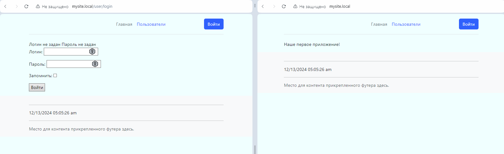
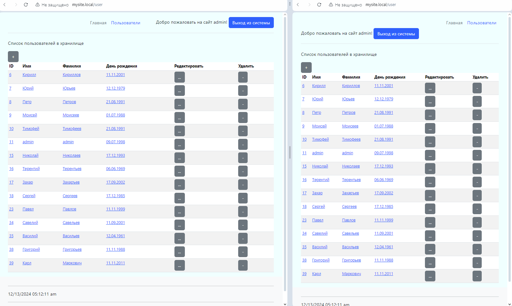
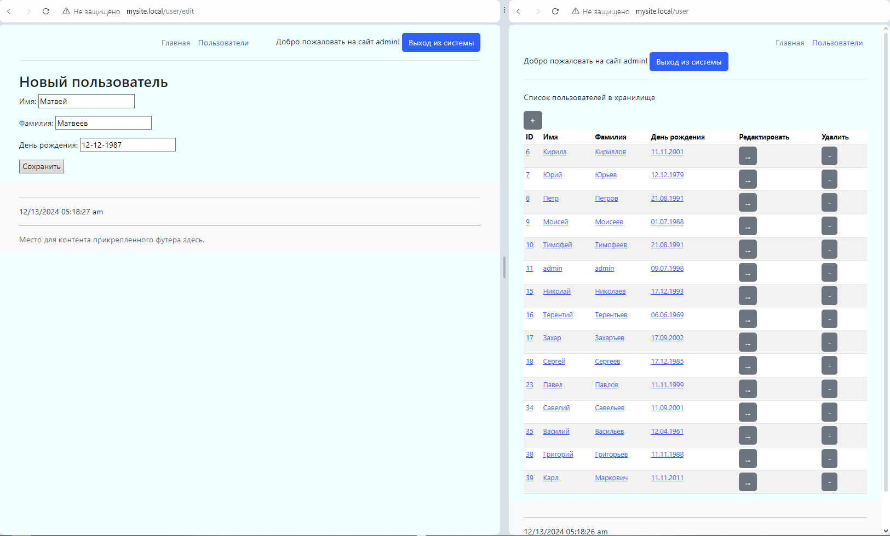
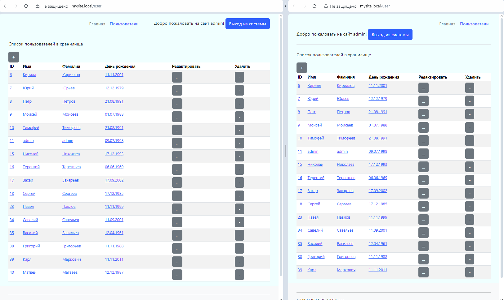
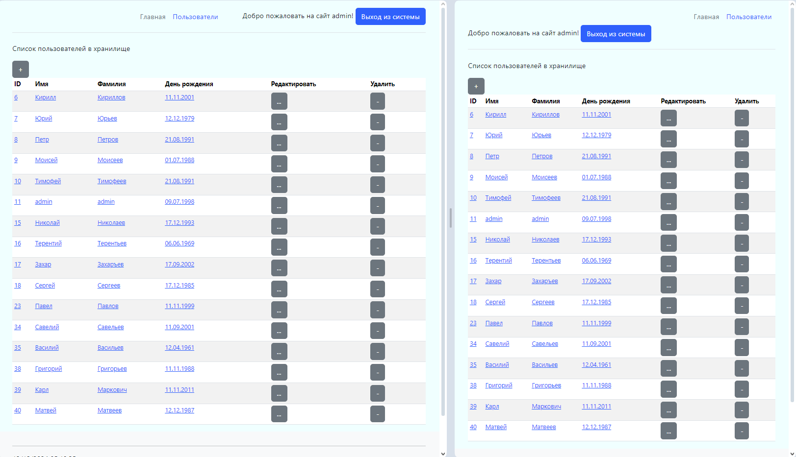

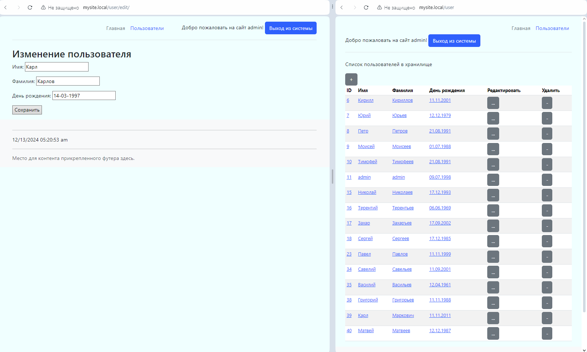
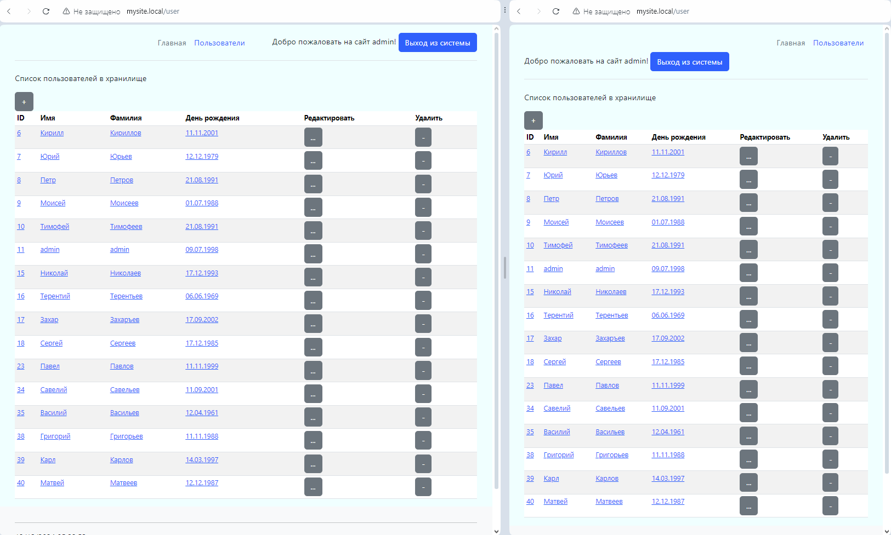
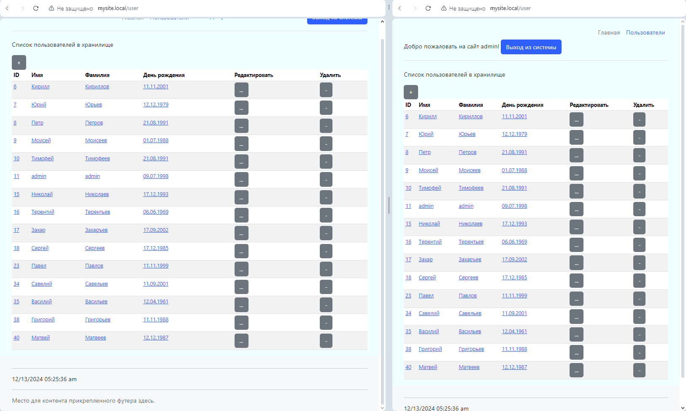
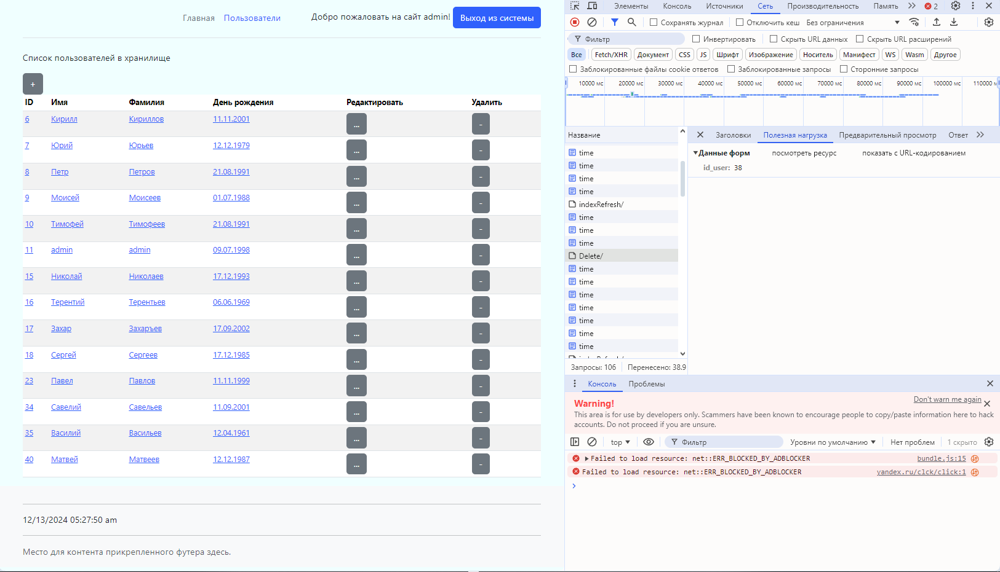
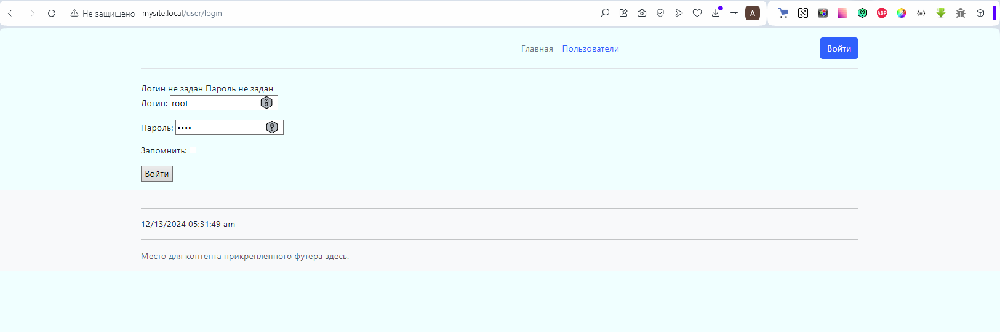
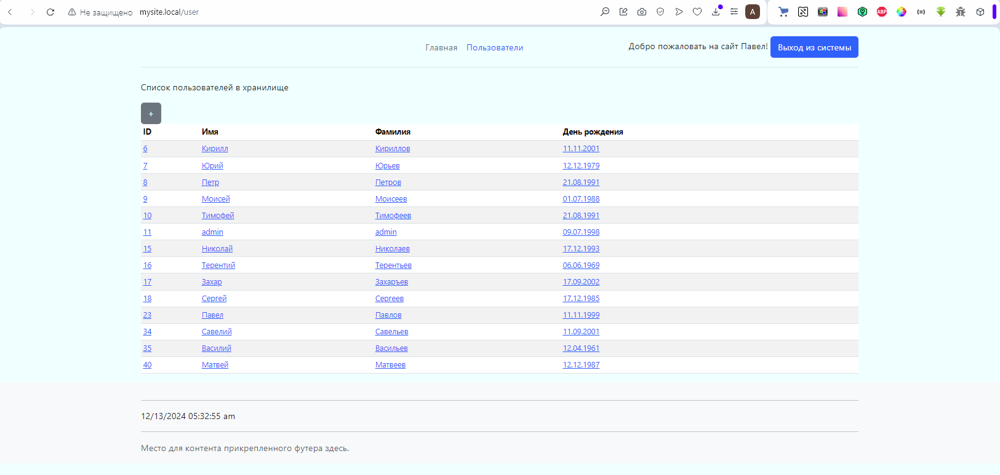
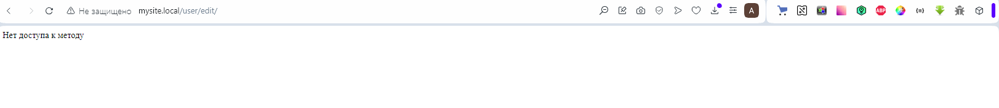